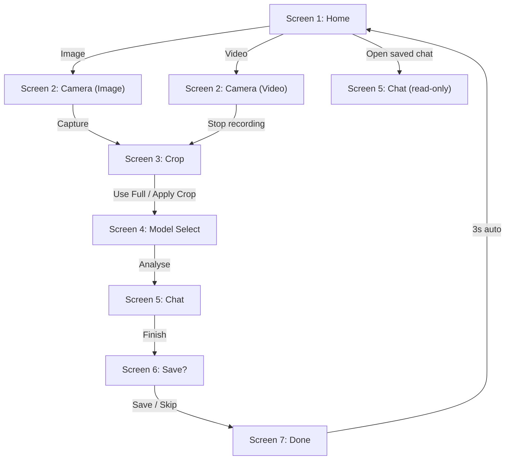

# Camera → Local LLM Inference App

## Description

A Python desktop app that captures images or short video clips from a webcam, optionally crops them, and sends them **in-memory** (no external file needed to be saved previously) to a local LLM via LM Studio for conversational analysis.

---

## Project Structure

```
Camera_LLM_Inference/
├── main.py                          # Entry point
├── requirements.txt                 # pip dependencies
├── chats/                           # Auto-created at runtime for saved sessions
└── app/
    ├── __init__.py
    ├── main_window.py               # QStackedWidget navigation, shared state
    ├── camera_thread.py             # QThread for OpenCV camera capture
    ├── llm_client.py                # OpenAI client → LM Studio, in-memory encode
    ├── chat_session.py              # ChatSession dataclass + JSON serialisation
    ├── chat_store.py                # Read/write chat sessions to chats/*.json
    ├── styles.py                    # Global stylesheet + design tokens
    └── screens/
        ├── __init__.py
        ├── screen1_home.py          # Home — Image/Video buttons + saved chats panel
        ├── screen2_capture.py       # Live camera feed, capture/record controls
        ├── screen3_crop.py          # Rubber-band crop with dimming overlay
        ├── screen4_model_select.py  # LM Studio URL + model dropdown
        ├── screen5_chat.py          # Chatbot with streaming, thumbnails, bubbles
        ├── screen6_save.py          # Name & save the session
        └── screen7_done.py          # Confirmation + auto-redirect home
```

---

## How to Run

```bash
cd "c:\Users\kurei\Documents\Machine_Deep Learning\Camera_LLM_Inference"
pip install -r requirements.txt
python main.py
```

### Prerequisites
1. **Webcam** connected
2. **LM Studio** running with a **vision model** loaded (e.g. LLaVA, Qwen-VL)
3. LM Studio **local server started** (default: `http://localhost:1234`)

---

## User Flow



---

## Key Design Decisions

| Decision | Choice | Rationale |
|---|---|---|
| **GUI framework** | PySide6 | Robust threading (QThread), rich widget set, no licensing issues |
| **Camera** | OpenCV in QThread | Non-blocking — GUI stays responsive at 30 fps |
| **In-memory encoding** | `cv2.imencode` → base64 | No file ever touches disk; data goes straight to the LLM API |
| **Video → LLM** | Sample up to 8 frames | Local VLMs don't accept video — sending evenly-spaced frames approximates it |
| **LLM API** | `openai` client → `localhost:1234` | LM Studio is OpenAI-compatible; swapping to a cloud provider later is trivial |
| **Chat persistence** | JSON files in `chats/` | Simple, portable, human-readable |

---

## Features

- Dark Theme (using qdarktheme)
- 7 Screens (Home, Capture, Crop, Model Select, Chat, Save, Done)
- Image and Video Capture
- LLM Chat with Streaming
- Save/Load Chat Sessions 
- Model Selection (LLM URL + Model Dropdown)
- Delete or Rename Saved Chats

> [!NOTE]
> The video input feature works by sending multiple frames from the video to the LLM in order to process as multiple images. The multiple frames (images) are sent as a panel (chained images) so the LLM can interpret it as one image (full context). This is done primarily due to employing a local LLM.

## What Was Verified

- ✅ All dependencies install cleanly
- ✅ All module imports resolve without errors
- ✅ App launches and renders Screen 1 correctly
- ✅ Fixed `pyqtdarktheme` API for v0.1.7 (`load_stylesheet` instead of `setup_theme`)

## Physical Testing Passed
- 📷 Camera feed with a physical webcam
- 🎬 Video recording and frame sampling
- 🤖 End-to-end LLM chat (requires LM Studio with a vision model running)
- 💾 Save/load chat sessions
- 📱 Verify smartphone can be used as webcam

## ⏳ In Progress
- [ ] Add date to Saved Chats
- [ ] Add title at top of chat (the chat name)
- [ ] Reform layout to be more robust

> [!IMPORTANT]
> Some dummy chats are present already under the Saved Chats section (`chats/` folder). This was collected during testing and left to provide various samples. As such, they can be safely deleted.