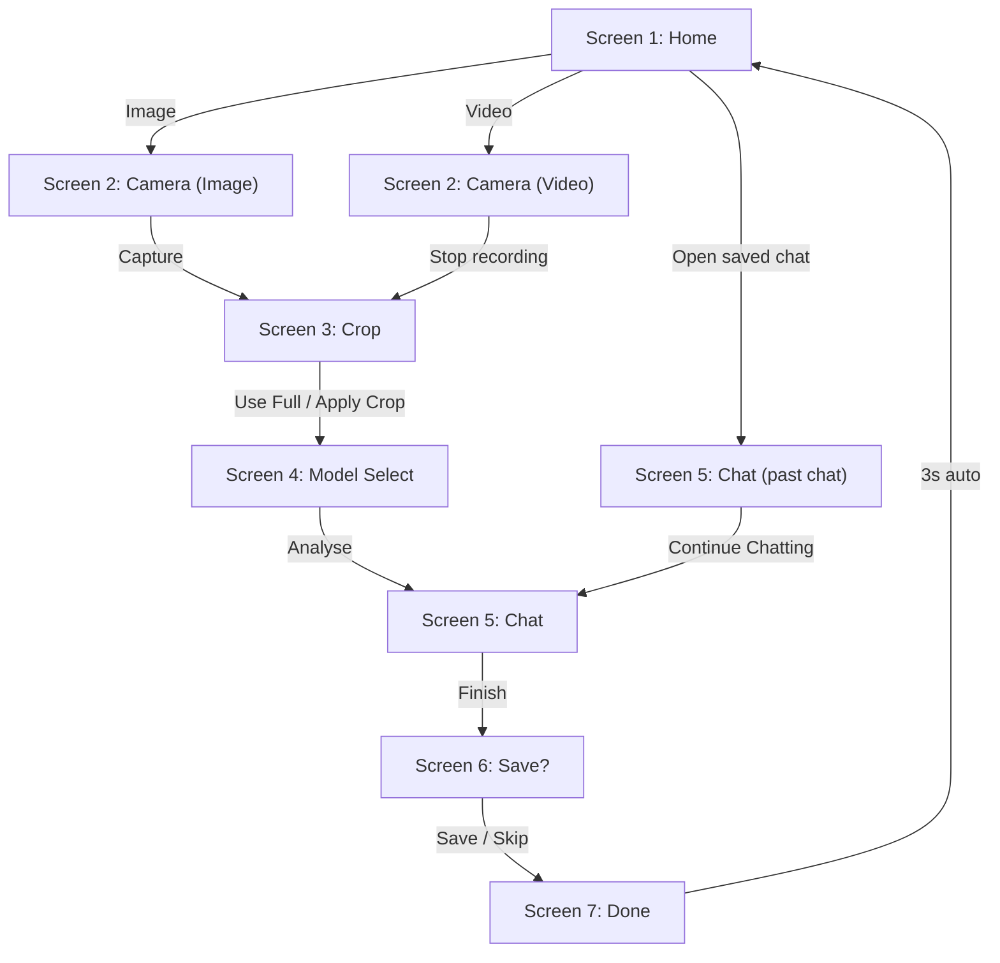

# Camera → Local LLM Inference App

## Description

A Python desktop app that captures images or short video clips from a webcam, optionally crops them, and sends them **in-memory** (no external file needed to be saved previously) to a local LLM via LM Studio for conversational analysis.

---

## Project Structure (Main Files)

```
Camera_LLM_Inference/
└── camera_llm/
       ├── __init__.py
       ├── camera_thread.py         # QThread for OpenCV camera capture
       ├── chat_session.py          # ChatSession dataclass + JSON serialisation
       ├── chat_store.py            # Read/write chat sessions to chats/*.json
       ├── cli.py                   # Entry point handling CLI and launching app (app initialization)
       ├── llm_client.py            # OpenAI client → LM Studio, in-memory encode
       ├── main_window.py           # Main window that aids navigation among the 7 screens
       ├── styles.py                # Global stylesheet + design tokens     
       └── screens/
           ├── __init__.py
           ├── screen1_home.py          # Dashboard + saved chats panel
           ├── screen2_capture.py       # Live camera feed, capture/record controls
           ├── screen3_crop.py          # Rubber-band crop with dimming overlay
           ├── screen4_model_select.py  # LM Studio URL + model dropdown
           ├── screen5_chat.py          # Chatbot with streaming, thumbnails, bubbles
           ├── screen6_save.py          # Name & save the session
           └── screen7_done.py          # Confirmation + auto-redirect home
└── chats/                           # Auto-created at runtime for saved sessions
├── pyproject.toml                   # Package metadata + entry points
├── requirements.txt                 # pip dependencies
```

---

## How to Run

### Prerequisites
1. **Webcam** connected or **IP camera** with reachable IP address (e.g. `http://[IP_ADDRESS]`)
2. **LM Studio** running with a **vision model** loaded (e.g. LLaVA, Qwen-VL)
3. LM Studio **local server started** (default: `http://localhost:1234`)

```bash
cd "[project-directory]"
git clone https://github.com/Kureishi/Camera_LLM_Inference.git
python camera_llm/cli.py
```

---

## Convenient Install through (using Pip)

```bash
conda create -n [env-name] python>=3.9
conda activate [env-name]
pip install camera-llm
camera-llm run
```

---

## Optional (download distribution zip file)

Alternatively, you can [Download the Distribution Zip File to Run as Standalone Application](https://drive.proton.me/urls/ASD3RNEVY0#txhcUP2W8rzJ). This saves you the time of downloading the repo and installing the other dependencies, but it also takes around 2.5 GB of disk space (in addition to less frequent updates). Once downloaded, unzip the file then navigate to "\CameraLLMInference\CameraLLMInference.exe" to run the application.

---

> [!CAUTION]
> All Prerequisites apply to all install options. The app has been tested and verified for all 3 options.

## User Flow



---

## Change Camera Feed Guide

1. If you are using a standard USB webcam, you can just type 0, 1, 2, etc. and hit Enter. It will connect as a regular USB camera.
2. If you want to use a smartphone, download a free app like IP Webcam (Android) or similar apps for iOS that broadcast your camera over WiFi. Start the server to use as a WiFi camera
3. Note the URL that will be set (ex: http://192.168.1.100:8080).
4. Paste that exact URL into the 'Camera' text box and press Enter.


---

## Key Design Decisions

| Decision | Choice | Rationale |
|---|---|---|
| **GUI framework** | PySide6 | Robust threading (QThread), rich widget set, no licensing issues |
| **Camera** | OpenCV in QThread | Non-blocking — GUI stays responsive at 30 fps |
| **In-memory encoding** | `cv2.imencode` → base64 | No file ever touches disk; data goes straight to the LLM API |
| **Video → LLM** | Sample up to 8 frames | Local VLMs don't accept video — sending evenly-spaced frames approximates it |
| **LLM API** | `openai` client → `localhost:1234` | LM Studio is OpenAI-compatible; swapping to a cloud provider later is trivial |
| **Chat persistence** | JSON files in `chats/` | Simple, portable, human-readable |

---

## Features

- 7 Screens (Home, Capture, Crop, Model Select, Chat, Save, Done)
- Image and Video Capture (With Rotate Feed Capability)
- LLM Chat with Streaming
- Save/Load Chat Sessions (Chats are listed with the last modified date and time)
- Model Selection (LLM URL + Model Dropdown)
- Delete or Rename Saved Chats
> [!CAUTION]
> Remember to load the same model that was used when first starting the chat (referenced in the title)

> [!NOTE]
> The video input feature works by sending multiple frames from the video to the LLM in order to process as multiple images. The multiple frames (images) are sent as a panel (chained images) so the LLM can interpret it as one image (full context). This is done primarily due to employing a local LLM.

## What Was Verified

- ✅ All dependencies install cleanly
- ✅ All module imports resolve without errors
- ✅ App launches and renders Screen 1 correctly
- ✅ Fixed `pyqtdarktheme` API for v0.1.7 (`load_stylesheet` instead of `setup_theme`)

## Physical Testing Passed
- 📷 Camera feed with a physical webcam
- 🎬 Video recording and frame sampling
- 🤖 End-to-end LLM chat (requires LM Studio with a vision model running)
- 💾 Save/load chat sessions
- 📱 Verify smartphone can be used as webcam (App used in Testing: **IP Webcam** for Android)

## ⏳ In Progress
- More robust UI

> [!IMPORTANT]
> Some dummy chats are present already under the Saved Chats section (`chats/` folder). This was collected during testing and left to provide various samples. As such, they can be safely deleted.